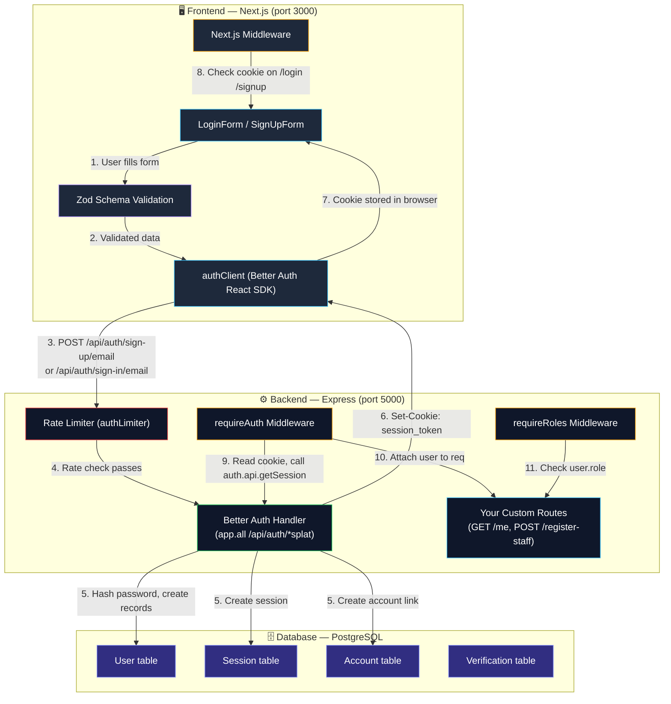
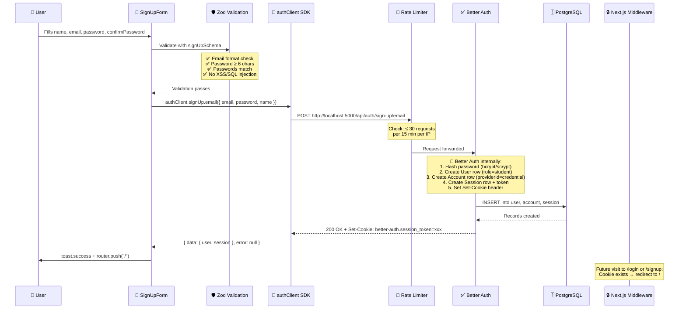
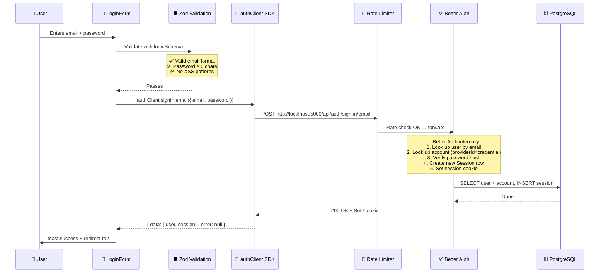
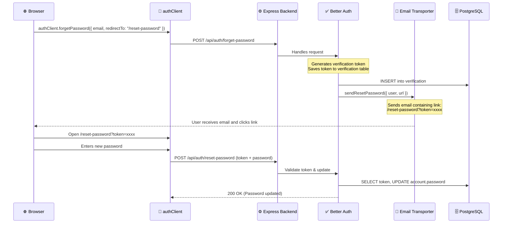
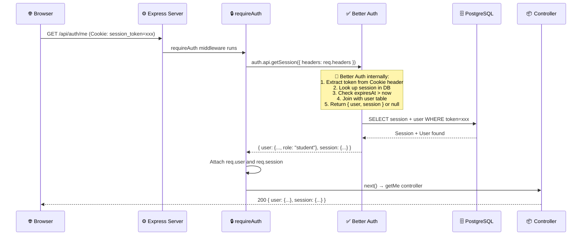
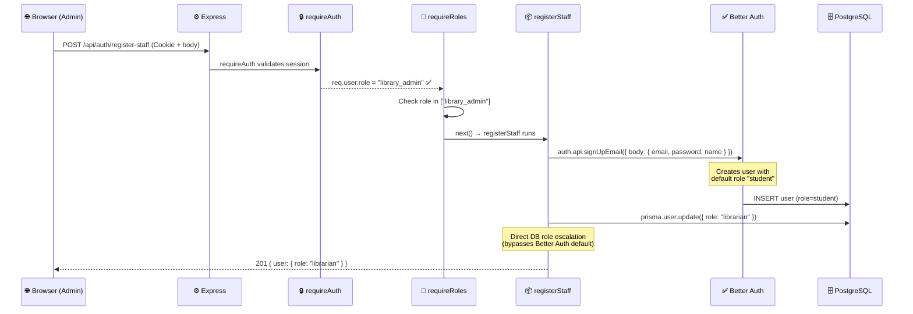
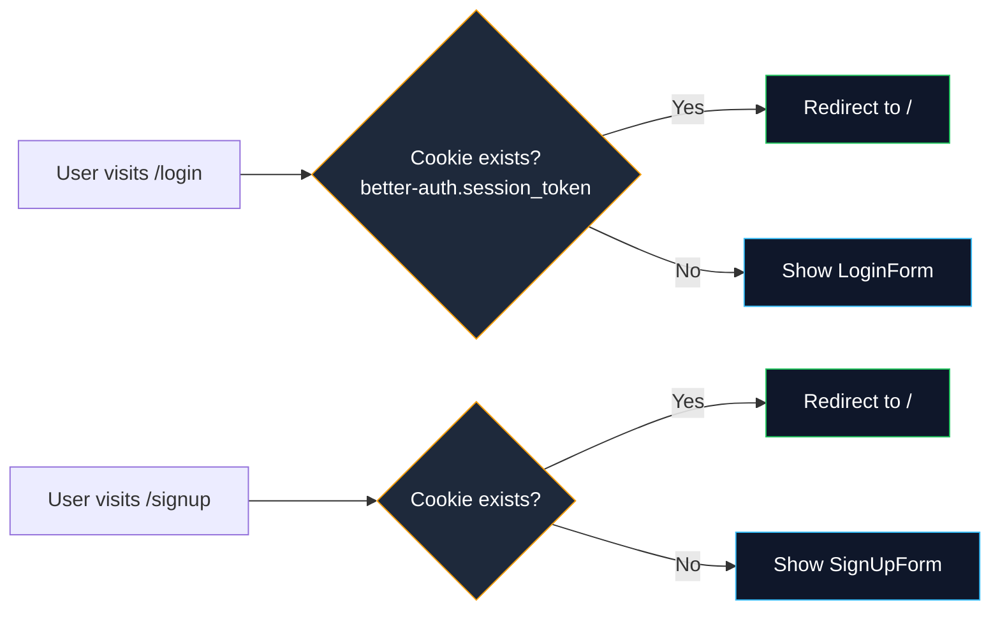
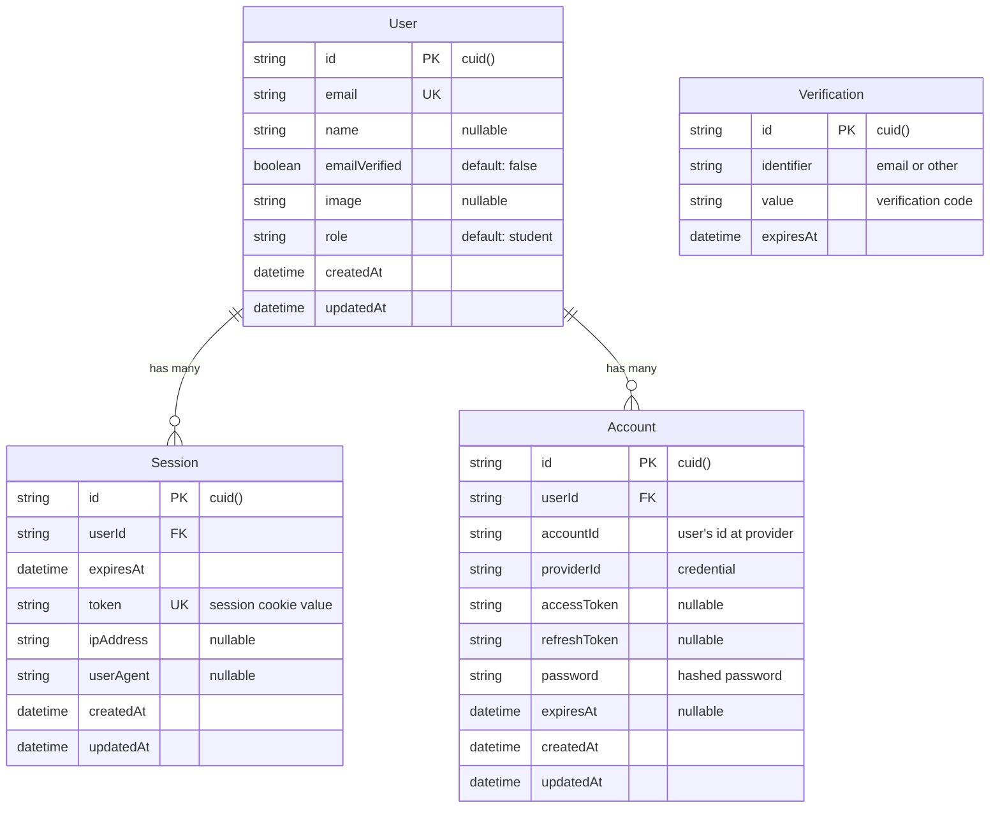
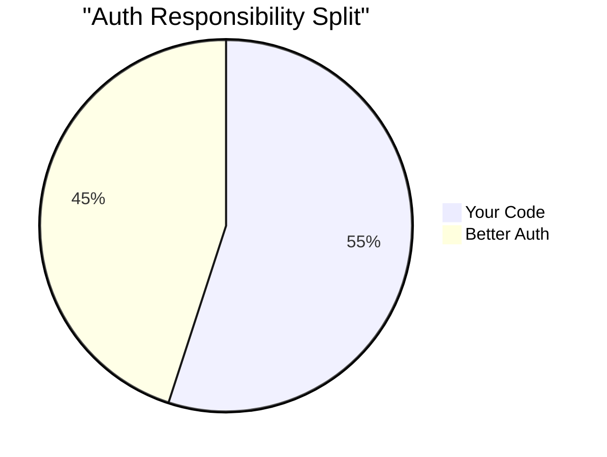

# 🔐 Authentication — End-to-End Walkthrough

## Architecture Overview

Your auth system is a **split-responsibility architecture** between:

| Layer        | Tech                               | Responsibility                                           |
| ------------ | ---------------------------------- | -------------------------------------------------------- |
| **Frontend** | Next.js 15 + Better Auth React SDK | Forms, validation, cookie-based sessions                 |
| **Backend**  | Express 5 + Better Auth Core       | Auth API endpoints, session management, password hashing |
| **Database** | PostgreSQL + Prisma                | User, Session, Account, Verification storage             |

---

## 🏗️ High-Level Architecture Diagram

---

## 📝 Sign Up Flow — Step by Step

### What YOU wrote (your code):

1. **[SignUpForm.tsx](file:///home/rvkrm/Desktop/code/projects/college-projects/library-client/src/modules/auth/components/SignUpForm.tsx)** — React form with `react-hook-form` + `zodResolver`
2. **[schemas/index.ts](file:///home/rvkrm/Desktop/code/projects/college-projects/library-client/src/modules/auth/schemas/index.ts)** — Zod schemas with XSS/SQL injection guards (`isSafeInput`)
3. **[auth-client.ts](file:///home/rvkrm/Desktop/code/projects/college-projects/library-client/src/lib/auth-client.ts)** — 8-line file that creates the SDK client pointing at `localhost:5000`
4. **Error handling** — catch `authError` from SDK, show toast, manage loading state

### What BETTER AUTH does (you didn't write this):

1. **Password hashing** — Uses scrypt/bcrypt internally, you never see the raw password
2. **User record creation** — Inserts into `user` table with `role: "student"` default
3. **Account linking** — Creates an `account` row with `providerId: "credential"`
4. **Session generation** — Creates a cryptographically-random session token
5. **Cookie management** — Sets `Set-Cookie: better-auth.session_token` with httpOnly, secure flags
6. **Duplicate email detection** — Returns error if email already exists

---

## 🔑 Login Flow — Step by Step

### What YOU wrote:

1. **[LoginForm.tsx](file:///home/rvkrm/Desktop/code/projects/college-projects/library-client/src/modules/auth/components/LoginForm.tsx)** — Form with email + password fields, error/loading state
2. **Zod validation on client** — Prevents garbage from even reaching the server

### What BETTER AUTH does:

1. **User lookup** — Finds user by email in DB
2. **Password verification** — Compares submitted password against stored hash
3. **Session creation** — New `session` row with `token`, `expiresAt`, `ipAddress`, `userAgent`
4. **Cookie setting** — `better-auth.session_token` sent back to browser

---

## 🔑 Forgot / Reset Password Flow

### What YOU wrote:
1. **[email.ts](file:///home/rvkrm/Desktop/code/projects/college-projects/library-server/src/utils/email.ts)** — Nodemailer utility to send formatted HTML emails using your SMTP config.
2. **[auth.ts configuration](file:///home/rvkrm/Desktop/code/projects/college-projects/library-server/src/config/auth.ts#L12-L29)** — The `sendResetPassword` callback to connect Better Auth with your nodemailer utility.

### What BETTER AUTH does:
1. **Endpoint exposure** — Exposes `/api/auth/forget-password` and `/api/auth/reset-password`.
2. **Token generation** — Creates a cryptographically safe reset token with an expiry period.
3. **Database lifecycle** — Automatically manages saving and checking the token against the `verification` table.
4. **Automatic url binding** — Assembles the URL containing the token automatically for the email template.

---

## 🛡️ Protected Route Access — Session Validation

### What YOU wrote:

1. **[rbac.ts → requireAuth](file:///home/rvkrm/Desktop/code/projects/college-projects/library-server/src/middlewares/rbac.ts#L9-L43)** — Middleware that calls `auth.api.getSession()` and attaches `req.user` / `req.session`
2. **[auth.controller.ts → getMe](file:///home/rvkrm/Desktop/code/projects/college-projects/library-server/src/modules/auth/auth.controller.ts#L9-L14)** — Simply returns the attached user/session

### What BETTER AUTH does:

1. **Cookie parsing** — Extracts `better-auth.session_token` from the `Cookie` header
2. **Session lookup** — Queries DB for matching session token
3. **Expiry check** — Validates session hasn't expired
4. **User hydration** — Joins `user` table to return full user object (including `role`)

---

## 👮 Role-Based Access Control (RBAC)

### Your 3 Roles:

| Role            | Access Level            | How Assigned                                    |
| --------------- | ----------------------- | ----------------------------------------------- |
| `student`       | Default for all signups | Auto-assigned by Better Auth config             |
| `librarian`     | Staff-level access      | Admin creates via `/register-staff` + DB update |
| `library_admin` | Full system access      | Admin creates via `/register-staff` + DB update |

### What YOU wrote:

1. **[requireRoles](file:///home/rvkrm/Desktop/code/projects/college-projects/library-server/src/middlewares/rbac.ts#L49-L72)** — Wraps `requireAuth` + role array check
2. **[registerStaff](file:///home/rvkrm/Desktop/code/projects/college-projects/library-server/src/modules/auth/auth.controller.ts#L20-L60)** — Creates user via BA, then escalates role via direct Prisma update
3. **[auth config → role field](file:///home/rvkrm/Desktop/code/projects/college-projects/library-server/src/config/auth.ts#L13-L22)** — `input: false` prevents users from setting their own role

### What BETTER AUTH does:

1. **User creation** — Standard signup with default role
2. **Additional fields support** — Allows `role` as a custom field on the User model

---

## 🍪 Session Cookie + Next.js Middleware

### What YOU wrote — [middleware.ts](file:///home/rvkrm/Desktop/code/projects/college-projects/library-client/src/middleware.ts):

- Runs at the **Edge** (before page renders)
- Checks for `better-auth.session_token` or `__secure-better-auth.session_token` cookie
- If cookie exists and user visits `/login` or `/signup` → **redirect to `/`**
- If no cookie → allow through (show auth page)

### What BETTER AUTH does:

- Sets the cookie name convention (`better-auth.session_token` / `__secure-better-auth.session_token`)
- You just read the cookie — BA manages its lifecycle

---

## 🗄️ Database Schema — What Better Auth Requires

> [!IMPORTANT]
> The `Account` table stores the **hashed password** (not the User table). This is Better Auth's design — it separates identity (User) from credentials (Account). The `providerId` is `"credential"` for email/password auth. If you added Google/GitHub OAuth later, each would be a separate Account row.

---

## 🔒 Security Layers Summary

| Layer                          | What                                                    | Where                                                                                                                          | Who Wrote It   |
| ------------------------------ | ------------------------------------------------------- | ------------------------------------------------------------------------------------------------------------------------------ | -------------- |
| **Client-side Zod validation** | XSS/SQL injection guards, email format, password length | [schemas/index.ts](file:///home/rvkrm/Desktop/code/projects/college-projects/library-client/src/modules/auth/schemas/index.ts) | ✍️ You         |
| **Server-side Zod validation** | Same guards on `registerStaff` endpoint                 | [auth.schema.ts](file:///home/rvkrm/Desktop/code/projects/college-projects/library-server/src/modules/auth/auth.schema.ts)     | ✍️ You         |
| **Auth rate limiting**         | 30 requests / 15 min per IP on `/api/auth/*`            | [rateLimit.ts](file:///home/rvkrm/Desktop/code/projects/college-projects/library-server/src/middlewares/rateLimit.ts)          | ✍️ You         |
| **Global rate limiting**       | 100 requests / 15 min per IP on all routes              | [rateLimit.ts](file:///home/rvkrm/Desktop/code/projects/college-projects/library-server/src/middlewares/rateLimit.ts)          | ✍️ You         |
| **Helmet**                     | HTTP security headers (CSP, XSS, etc.)                  | [app.ts](file:///home/rvkrm/Desktop/code/projects/college-projects/library-server/src/app.ts#L50)                              | ✍️ You         |
| **CORS**                       | Only `CORS_ORIGIN` allowed with credentials             | [app.ts](file:///home/rvkrm/Desktop/code/projects/college-projects/library-server/src/app.ts#L51-L54)                          | ✍️ You         |
| **Password hashing**           | scrypt/bcrypt on signup                                 | Internal to Better Auth                                                                                                        | 🤖 Better Auth |
| **Session tokens**             | Cryptographic random tokens, httpOnly cookies           | Internal to Better Auth                                                                                                        | 🤖 Better Auth |
| **Role protection**            | `input: false` on role field prevents self-escalation   | [auth.ts config](file:///home/rvkrm/Desktop/code/projects/college-projects/library-server/src/config/auth.ts#L19)              | ✍️ You         |
| **RBAC middleware**            | `requireAuth` + `requireRoles` on protected routes      | [rbac.ts](file:///home/rvkrm/Desktop/code/projects/college-projects/library-server/src/middlewares/rbac.ts)                    | ✍️ You         |
| **Next.js edge middleware**    | Redirect authenticated users away from auth pages       | [middleware.ts](file:///home/rvkrm/Desktop/code/projects/college-projects/library-client/src/middleware.ts)                    | ✍️ You         |
| **Trusted origins**            | Only `localhost:3000` can call auth APIs                | [auth.ts config](file:///home/rvkrm/Desktop/code/projects/college-projects/library-server/src/config/auth.ts#L9)               | ✍️ You         |

---

## 📊 Responsibility Split — Your Code vs Better Auth

### ✍️ What YOU own (~55%):

- Form UI and UX (React Hook Form + Shadcn components)
- Client & server-side input validation (Zod schemas with security refinements)
- Rate limiting strategy (express-rate-limit)
- RBAC middleware (requireAuth, requireRoles)
- Role escalation logic (registerStaff controller)
- Next.js edge middleware for route guarding
- Security headers (Helmet, CORS)
- Database schema definition (Prisma)
- Auth configuration (Better Auth options)

### 🤖 What BETTER AUTH owns (~45%):

- Password hashing and verification
- Session token generation and cookie management
- The entire `/api/auth/*` HTTP API surface (signup, signin, signout, session)
- Account linking model (credential, OAuth providers)
- Cookie naming conventions and security flags
- Session expiry and refresh logic
- The React SDK hooks (`authClient.signIn.email`, `authClient.signUp.email`)
- `auth.api.getSession()` for server-side session retrieval

> [!NOTE]
> The `app.all('/api/auth/*splat', toNodeHandler(auth))` line in [app.ts:59](file:///home/rvkrm/Desktop/code/projects/college-projects/library-server/src/app.ts#L59) is the **bridge** — it hands over ALL requests to `/api/auth/*` directly to Better Auth's internal router. Better Auth then handles signup, signin, signout, session retrieval, etc. without you writing any controller code for those endpoints.

> [!WARNING]
> The `toNodeHandler(auth)` line is placed **before** `express.json()` body parser (line 62). This is intentional — Better Auth reads the raw request stream itself. If body parsers ran first, the stream would be consumed and Better Auth would get an empty body.
